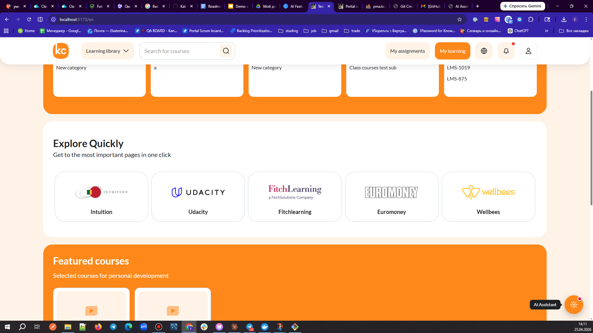
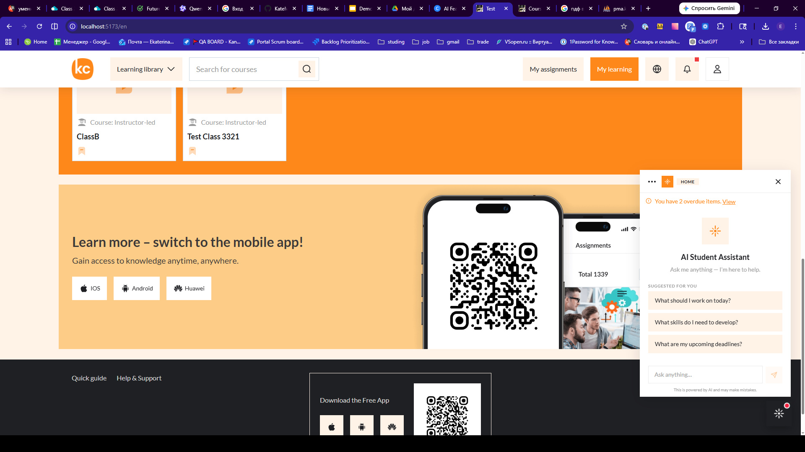
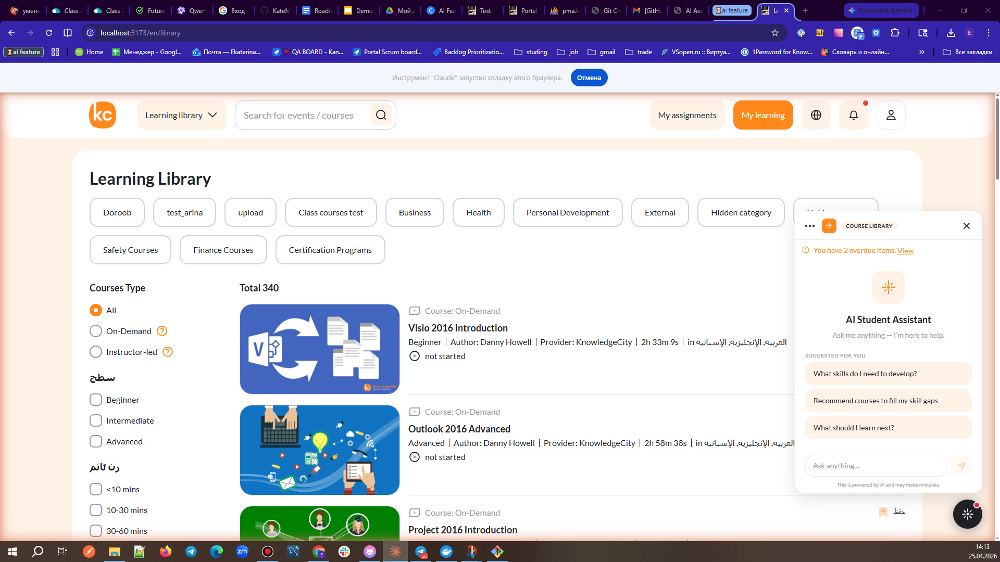
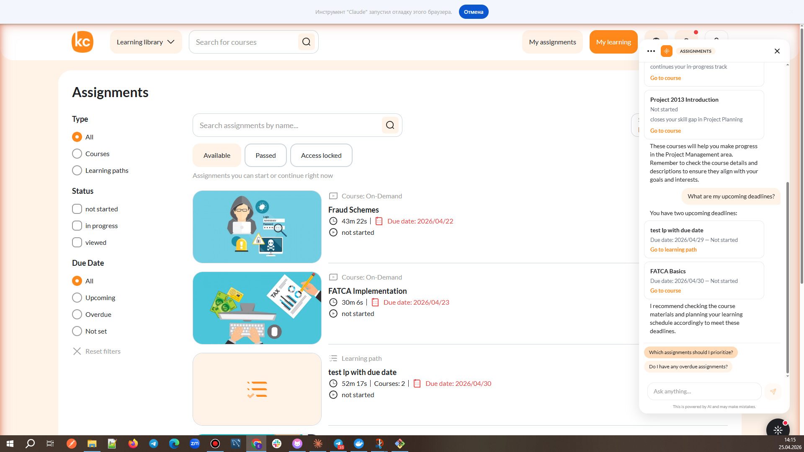
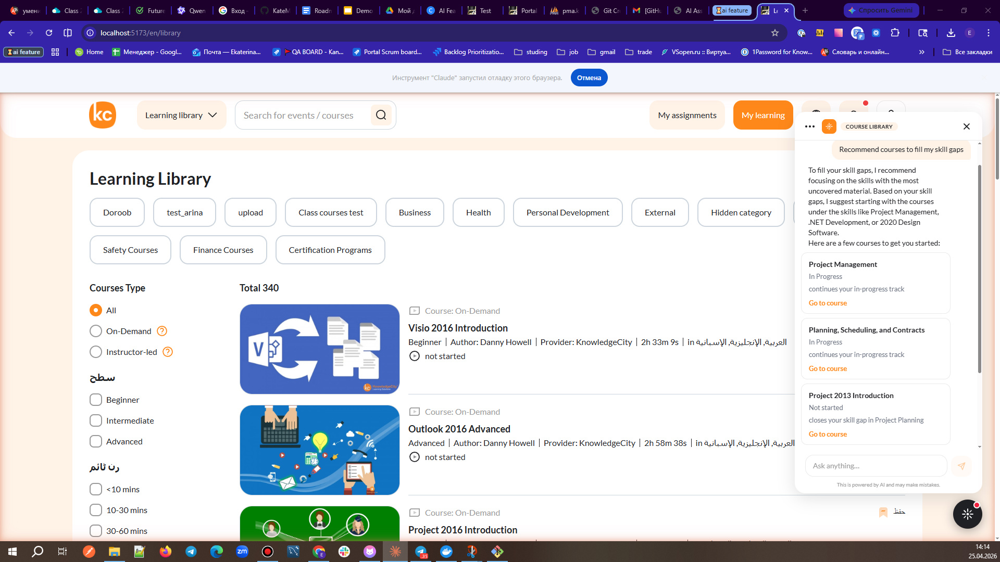
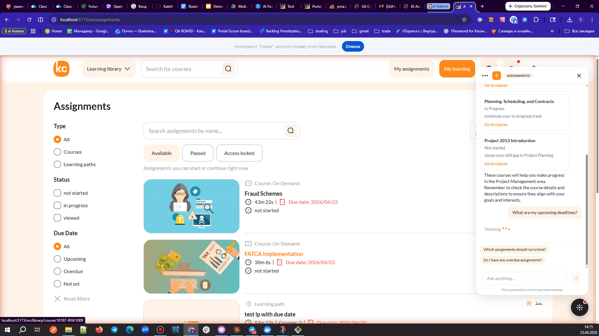
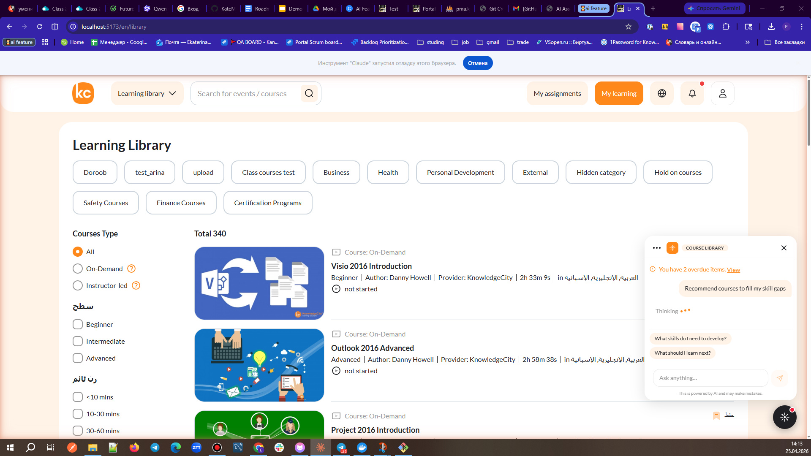
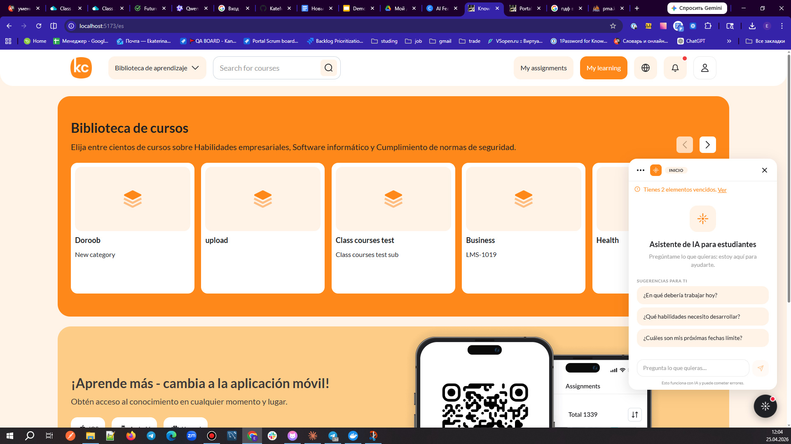
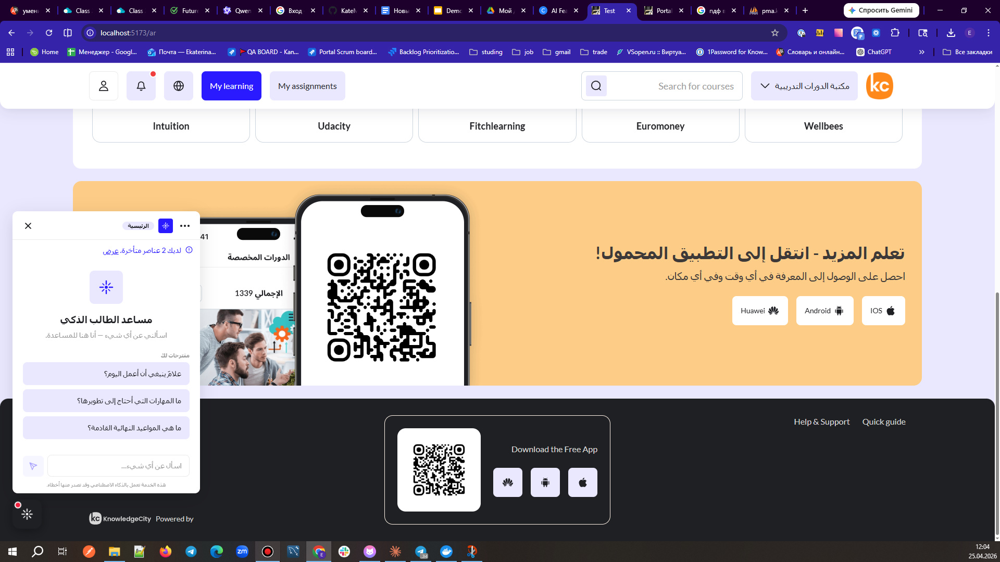
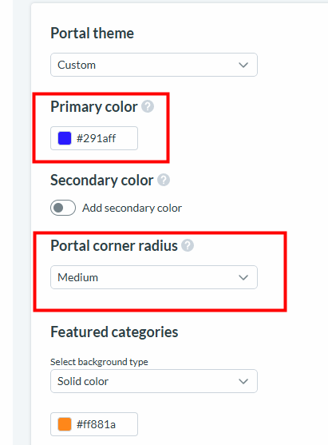

AI Student Assistant for Learning Portal
Role: Product Owner / Project Manager
Status: Working MVP ✅
Timeline: [Add dates, e.g., Q1 2026]
🎯 Project Overview
An AI-powered Student Assistant embedded directly into the learning portal. It helps learners stay on track, understand what to focus on next, and navigate the platform through a conversational interface.
Key Features:
Context-Aware: Adapts to the student's current page (14 page types detected).
Personalized: Provides answers based on real learner data (assignments, progress, skill gaps).
Proactive: Surfaces overdue tasks and recommends "what to learn next".
Localized: Widget interface supports 9 languages (EN, AR, ES, FR, DE, PT, HI, BN, UR).
Streaming: Real-time SSE streaming with a "typewriter" effect for smooth UX.
👤 My Contribution (PM/PO)
I managed the product strategy and delivery. I focused on requirements, QA, and user value, while using Claude Code as a development partner for implementation.
What I did:
Product Strategy: Defined scope, user stories (US-01..US-04), and acceptance criteria (BRD).
AI Collaboration: Scoped tasks, challenged assumptions, and validated outputs in tight human-AI loops.
QA & Delivery: Coordinated 3 QA sweeps + pre-submission audit. Managed localization for 9 languages (837 translation rows).
Technical Decisions: Chose provider-agnostic architecture (Groq/Llama 3.3) to avoid vendor lock-in.
Documentation: Maintained Confluence pages, Roadmap, and Jira tickets (PORTAL-2441).
Tech Stack: SvelteKit, PHP, Groq (Llama 3.3), SSE Streaming, SQL, Mixpanel.
🚀 Results & Metrics
72 commits across 3 feature branches (auto-linked to Jira).
~6,167 lines added (Backend + Frontend + Translations).
4 User Stories delivered and passed QA.
9 Languages supported for widget chrome (837 translation rows).
Performance fix: Reduced TTFB from ~16s to 516ms (31x faster) by debugging PHP-FPM buffering.
Zero downtime during integration with existing portal infrastructure.
## 🎨 UI/UX Implementation

**Main Interface & States:**
- **Floating Button (Hover):** 
- **Empty State (Home):** 
- **Empty State (Library):** 

**Chat & Results:**
- **Assignments Result:** 
- **Library Result 1:** 
- **Library Result 2:** 
- **Thinking Indicator:** 

**Localization & Branding:**
- **Spanish Version:** 
- **Arabic RTL & Theme:** 
- **LMS Theme Customization:** 

🎥 Demo & Documentation
Watch the Demo:
https://docs.google.com/presentation/d/1Dif44-R40kw_xUYOrvysvHrp9VgC_F-CfeNfgbZjr28/edit?slide=id.p#slide=id.p
Read the Details:
📄 Project Summary PDF
🔗 Confluence BRD
🎨 Design/Prototypes
🛠 Architecture Highlights
Streaming: Backend streams chunk-by-chunk via SSE. Frontend uses a typewriter reveal for smooth UX.
Structured Data: Model emits [CARD:...] tokens. Frontend parses them into rich UI cards with localized dates.
Safety: Localized "Honesty" rule prevents hallucinations. Prompt-injection hardening blocks data leaks.
Observability: Structured JSON logs per request for future cost/latency dashboards.
🔮 What's Next? (Roadmap)
Cost Optimization: Trim system prompt to double the daily turn budget.
Multilingual AI: Switch to a multilingual provider (e.g., Gemini Flash) for free-form prose in all 9 languages.
Data Parity: Add backend data for "My Progress" and "Saved" pages.
Testing: Add integration tests with a mocked streaming client.
Full roadmap details are available in the Project Summary PDF.
📄 License & References
Jira Ticket: PORTAL-2441
Documentation: Confluence — AI Feature MVP BRD & Roadmap
This project was developed as part of my work at KnowledgeCity. Code was generated with AI assistance (Claude Code) under my supervision as Product Owner.
